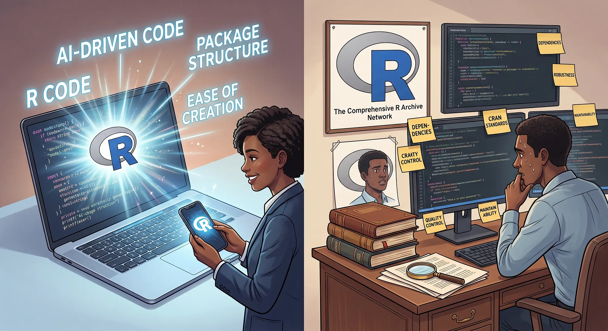

## AI makes packages easier to write

{height="330"}

More generated code makes design, documentation, and review even more valuable.

[Graphic: Pierre DeBois, *AI Made R Packages Easy to Write. But Did It Make Packages in CRAN Better?*, DataDrivenInvestor, 23 September 2026](https://medium.datadriveninvestor.com/ai-made-r-packages-easy-to-write-but-did-it-make-packages-in-cran-better-2569bd217e13){.small}

::: notes
Use the graphic to open a discussion: what makes a package useful and trustworthy?
The article raises concerns about documentation; do not infer a causal effect of AI from the illustration.
The graphic is third-party content and is excluded from the course's CC BY-SA license.
:::

## 2024 vs. 2026

| Disappointment in 2024 | Productive use in 2026 |
| --- | --- |
| Bad at translating code (e.g. R to Julia) | Translates code well between e.g. SAS and R |
| Bad at mathematics, e.g. inverse functions | Can solve difficult math problems |
| Bad at writing tests | Draft tests, run them, and investigate failures |
| Bad at slide generation | Create and revise slides with visual feedback |
| Made up literature references | Can reliably find literature references |


::: notes
This is a retrospective on my own experience, not a guarantee for every task or model.
For R-to-Julia translation, check missing values, indexing, types, and numerical tolerances.
For an inverse, substitute back into the original function and check the domain.
For literature, open the paper and verify authors, DOI, and the claim it supports.

**All of these are now possible with current AI tools.** 
Tool access and iterative feedback have changed the experience substantially
But success still needs checking!
:::

## Keep the engineering workflow

**Design → Plan → Implement in steps → Check → Review**

1. Explain the user need, interface, constraints, and acceptance criteria
2. Ask the assistant to inspect the project and propose a plan
3. Implement one small, reviewable change at a time
4. Run examples, tests, and package checks; inspect the results
5. Review the diff and update documentation before committing

[Hadley Wickham's Tidy design principles](https://tidydesign.substack.com/) provide useful reading for designing APIs that humans and assistants can understand.

::: notes
Example prompt: “Read the design vignette and existing tests. Propose a plan for adding a missing-value option without changing existing defaults. Wait for my review of the plan before implementing.”
Discuss where a human decision is needed: the API, statistical assumptions, acceptance criteria, and final review.
:::

## Choose an IDE that fits your work

| IDE | Useful AI integration |
| --- | --- |
| [VS Code](https://code.visualstudio.com/docs/copilot/overview) | GitHub Copilot for inline/tab completion and chat; extensions for [Claude Code](https://code.claude.com/docs/en/vs-code) and [Codex](https://developers.openai.com/codex/ide/) |
| [Positron](https://positron.posit.co/assistant.html) | Posit's AI integration, **Posit Assistant**, with context from your R session, objects, plots, and console history |

- Tab completion helps with a local edit; an agent can work across files and run checks
- Start with a small task and inspect the changes and tool output
- Choose approved providers and share only data and code you are allowed to send

::: notes
Posit Assistant is the current name in the Positron documentation (October 2026).
Participants can continue using RStudio for the package exercises; switching IDE is optional.
Accounts, available models, and costs depend on the chosen provider and setup.
:::

## Instructions for your project

[AGENTS.md](https://agents.md/) gives compatible coding agents shared project context. Put it at the repository root; use scoped instructions where needed.

Keep instructions short, accurate, and version controlled. Check how your assistant discovers them.

Example:

```markdown
# Working on this R package

- Read DESCRIPTION, the design vignette, and CONTRIBUTING.md first.
- Keep public function signatures and defaults stable unless requested.
- Edit roxygen source; regenerate Rd and NAMESPACE with devtools::document().
- Add tests for changed behavior; run devtools::test() and devtools::check().
- Update vignettes and NEWS.md for user-visible changes.
- Explain mathematical changes and benchmark performance claims.
- Report the changed files, check results, and unresolved questions.
```

::: notes
AGENTS.md gives project-wide conventions; a skill gives task-specific guidance; a prompt gives the immediate task.
Additional examples: tests/AGENTS.md can describe reference data and tolerances; src/AGENTS.md can explain compiled-code conventions.
Support and discovery rules vary across assistants. Instructions do not replace permissions or sandbox controls.
:::

## Give the assistant skills

- A `SKILL.md` packages instructions for a particular kind of task
- Explore [posit-dev/skills](https://github.com/posit-dev/skills)
    - Use [r-package-development](https://github.com/posit-dev/skills/blob/main/r-lib/r-package-development/SKILL.md) for R package conventions and development guidance
    - Use [critical-code-reviewer](https://github.com/posit-dev/skills/tree/main/posit-dev/critical-code-reviewer) to request a critical review with concrete findings
- Install using your assistant's supported mechanism, then check that the relevant skill is loaded

Skills supply reusable guidance; project documentation supplies the facts about **your** package.

::: notes
Read a skill before installing it. Check its assumptions and commands against your project.
Ask: “Use the R package development skill for this change, then use the critical code reviewer skill to review the diff. Report each finding with its location and a suggested fix.”
Loading and activation differ between tools; linking a file in a prompt does not necessarily install a skill.
:::

## Keep documentation and code in sync

**Example from our `mmrm` work:** use the mathematical description to identify a faster algorithm, then implement it in code.

- Start with the current [mathematical documentation](https://openpharma.github.io/mmrm/main/articles/algorithm.html), assumptions, and notation
- Ask for an optimization proposal and review the derivation
- Implement in steps; compare with the existing implementation and benchmark
- Update the math description, code, tests, and relevant release notes together

::: notes
This is the instructor's experience supplied for the course, not a claim that the linked vignette documents a particular AI-assisted change or measured speedup.
For a numerical algorithm, compare estimates, covariance matrices, likelihoods, convergence, and edge cases as appropriate. Report both correctness evidence and benchmark conditions.
Do not treat the optimized implementation as the sole source of expected test values.
:::


## Model Context Protocol

[Model Context Protocol (MCP)](https://modelcontextprotocol.io/) is an open protocol that gives AI applications a standard way to connect with external systems.

- An MCP **server** advertises capabilities to an AI application's MCP **client**
- Those capabilities can include **tools** (actions), **resources** (context or data), and reusable **prompts**
- The model can request a capability; the client executes it and returns the result to the conversation
- Servers may be local or remote, so access controls and the data exposed still matter

::: notes
MCP standardizes the connection, not the model's judgement. The client controls which servers are available and should show or enforce appropriate permissions before a tool has side effects.
The next slide applies this pattern to an R session and package documentation.
:::

## Let AI use your R package through MCP

- [mcptools](https://posit-dev.github.io/mcptools/) lets an MCP client interact with R
- [btw](https://posit-dev.github.io/btw/) supplies tools for documentation and session context.

```r
# In a disposable R session with example data:
install.packages(c("mcptools", "btw"))
library(yourpackage) # replace with your installed package
mcptools::mcp_session()
```

Configure the client's local MCP server to run:

```bash
Rscript -e 'mcptools::mcp_server()'
```

Ask it to read your function's help, run a small example, and explain the result. Verify the actual tool calls and output.

::: notes
The package name is a placeholder. The mcptools documentation shows client-specific configuration; follow it for the assistant you use.
Registering a session does not automatically turn each exported function into a dedicated MCP tool: the assistant can use R execution and documentation tools, or you can configure specific functions.
Use synthetic data. R execution can read files and alter session state; keep tool permissions and the working directory appropriate to the demo.
:::

## Example: an MCP server in an R package

This [autoslider.core MCP server](https://github.com/pharmaverse/autoslider.core/blob/main/inst/mcp/autoslider_mcp_server.R) defines R functions, registers them as MCP tools, then starts the server. Scroll through the source below.

```r
#!/usr/bin/env Rscript
# Autoslider MCP Server
#
# Exposes the autoslider.core pipeline as MCP tools so any MCP-compatible
# client (Claude Desktop, Claude Code, Cursor, Open WebUI, etc.) can
# orchestrate slide generation conversationally.
#
# Usage:
#   Rscript inst/mcp/autoslider_mcp_server.R
#
# Register in your MCP client — see inst/mcp/claude_desktop_config_snippet.json
#
# Requirements:
#   install.packages("mcptools")        # on CRAN
#   # ellmer and autoslider.core already in your renv/library

suppressPackageStartupMessages({
  library(mcptools)
  library(ellmer)
  library(autoslider.core)
  library(filters)
  library(dplyr)
})

# ---- session state ----------------------------------------------------------
# Holds spec and outputs across tool calls within one Claude session.
.state <- new.env(parent = emptyenv())
.state$spec    <- NULL
.state$outputs <- NULL

# ---- helpers ----------------------------------------------------------------
stop_if <- function(cond, msg) if (cond) stop(msg, call. = FALSE)
require_spec    <- function() stop_if(is.null(.state$spec),    "No spec loaded. Call load_spec first.")
require_outputs <- function() stop_if(is.null(.state$outputs), "No outputs generated. Call run_pipeline first.")

# ---- tool functions ---------------------------------------------------------

fn_list_programs <- function() {
  spec_file <- system.file("spec.yml", package = "autoslider.core")
  spec      <- read_spec(spec_file)
  programs  <- sort(unique(vapply(spec, `[[`, character(1), "program")))
  paste(programs, collapse = "\n")
}

fn_load_spec <- function(spec_path, filters_path, program_filter, suffix_filter) {
  if (spec_path == "default") {
    spec_path <- system.file("spec.yml", package = "autoslider.core")
  }
  if (filters_path == "default") {
    filters_path <- system.file("filters.yml", package = "autoslider.core")
  }

  filters::load_filters(yaml_file = filters_path, overwrite = TRUE)
  spec <- read_spec(spec_path)

  if (nzchar(program_filter)) {
    progs <- trimws(strsplit(program_filter, ",")[[1]])
    spec  <- filter_spec(spec, program %in% progs, verbose = FALSE)
  }

  if (nzchar(suffix_filter)) {
    suffs <- trimws(strsplit(suffix_filter, ",")[[1]])
    spec  <- filter_spec(spec, suffix %in% suffs, verbose = FALSE)
  }

  .state$spec    <- spec
  .state$outputs <- NULL

  sprintf(
    "Spec loaded: %d output(s).\n%s",
    length(spec),
    paste(names(spec), collapse = "\n")
  )
}

      "Must call load_spec first.",
      "Pass dataset_paths as comma-separated name=path pairs, e.g.",
      '"adsl=/data/adsl.rds,adae=/data/adae.rds".',
      'Use "example" to use the built-in example CDISC datasets.'
    ),
    arguments = list(
      dataset_paths = type_string(
        'Comma-separated name=path.rds pairs, or "example" for built-in data.'
      )
    )
  ),

  tool(
    fun = fn_add_ai_notes,
    name = "add_ai_notes",
    description = paste(
      "Generate AI speaker notes for each slide output using any supported LLM.",
      "Reads prompts from prompt.yml and calls the chosen provider.",
      "Must call run_pipeline first.",
      "Supported providers: anthropic, ollama, openai, deepseek."
    ),
    arguments = list(
      provider = type_string(
        'LLM provider: "anthropic", "ollama", "openai", or "deepseek".'
      ),
      model = type_string(
        'Model name for the provider, e.g. "claude-haiku-4-5", "llama3.2", "gpt-4o-mini", "deepseek-chat".'
      ),
      api_key = type_string(
        paste(
          'API key. Leave empty ("") to read from the provider\'s env var',
          "(ANTHROPIC_API_KEY, OPENAI_API_KEY, DEEPSEEK_API_KEY). Not required for ollama."
        )
      ),
      prompt_path = type_string(
        'Path to prompt.yml. Use "default" for the built-in package prompts.'
      ),
      base_url = type_string(
        paste(
          'Optional custom base URL. Useful for local Ollama ("http://localhost:11434")',
          'or self-hosted endpoints. Leave empty ("") for provider defaults.'
        )
      )
    )
  ),

  tool(
    fun = fn_add_ai_story,
    name = "add_ai_story",
    description = paste(
      "Post-process a generated deck: read the .pptx, ask an LLM to tell the story",
      "of the tables, and insert REAL content slides (title + bullets) -- a summary",
      "section at the front and a conclusions section at the end. Unlike add_ai_notes",
      "(which hides text in speaker notes), these slides show in presentation mode.",
      "Must call run_pipeline and generate_slides first.",
      "Supported providers: anthropic, ollama, openai, deepseek."
    ),
    arguments = list(
      provider = type_string(
        'LLM provider: "anthropic", "ollama", "openai", or "deepseek".'
      ),
      model = type_string(
        'Model name for the provider, e.g. "claude-haiku-4-5", "llama3.2", "gpt-4o-mini", "deepseek-chat".'
      ),
      api_key = type_string(
        paste(
          'API key. Leave empty ("") to read from the provider\'s env var',
          "(ANTHROPIC_API_KEY, OPENAI_API_KEY, DEEPSEEK_API_KEY). Not required for ollama."
        )
      ),
      base_url = type_string(
        paste(
          'Optional custom base URL. Useful for local Ollama ("http://localhost:11434")',
          'or self-hosted endpoints. Leave empty ("") for provider defaults.'
        )
      ),
      infile = type_string(
        "Path to the generated .pptx to read (the deck produced by generate_slides)."
      ),
      outfile = type_string(
        'Path to write the augmented deck to. Leave empty ("") to overwrite infile in place.'
      ),
      max_slides = type_string(
        "Maximum slides per section (summary and conclusions). Empty string defaults to 4."
      )
    )
  ),

  tool(
    fun = fn_generate_slides,
    name = "generate_slides",
    description = paste(
      "Assemble the generated outputs into a PowerPoint (.pptx) file.",
      "Must call run_pipeline first.",
      "Returns the absolute path to the written file."
    ),
    arguments = list(
      outfile = type_string(
        'Output file path for the .pptx, e.g. "/tmp/study_slides.pptx".'
      ),
      template = type_string(
        'Path to a .pptx template file. Use "default" for the built-in basic.pptx theme.'
      )
    )
  ),

  tool(
    fun = fn_reset,
    name = "reset",
    description = "Clear the session state (loaded spec and generated outputs). Useful to start a fresh run.",
    arguments = list()
  )

)

# ---- start server -----------------------------------------------------------

mcp_server(tools = tools)
```


::: notes
Use this as a concrete example of an MCP server implemented in an R package. Notice the session state, the tool functions, their descriptions and arguments, and the call to mcp_server() at the end.
The panel loads the current source from the autoslider.core repository; use the link above if embedded remote content is blocked.
:::

## Important: Review the result, including tests

- Does the implementation meet the design and preserve the public API?
- Do tests check independent expected results, boundaries, and failure cases?
- Are examples runnable and documentation consistent with the code?
- Are dependencies and external references real and necessary?
- Have you read the diff and the actual check output?

Use a fresh review pass; fix the findings and rerun affected checks.
AI review can be very helpful for larger diffs (but ideally you want small diffs).

::: notes
An assistant can write code and tests that agree with the same misunderstanding. Use a hand-calculated example or a separately trusted implementation where possible.
Ask the reviewer to identify risks and missing evidence, rather than simply asking “Is this good?”. A second AI review complements human review.
:::

## Exercise: one small package change

Work on a branch of your workshop package (or follow the instructor's demo).

1. Describe one small improvement and its acceptance criteria
2. Draft an `AGENTS.md` with conventions and check commands
3. Ask an assistant to plan the change using the [R package skill](https://github.com/posit-dev/skills/blob/main/r-lib/r-package-development/SKILL.md)
4. Implement it with documentation and tests; inspect the diff
5. Request a [critical review](https://github.com/posit-dev/skills/tree/main/posit-dev/critical-code-reviewer), run checks, and discuss one finding

**Discuss:** What helped? What did you need to correct? What evidence made you trust the result?

::: notes
Suggested timing for the hour: 30 minutes for the slides/demo, 20 minutes guided practice, 10 minutes discussion.
Possible task: document and test an existing argument, or add an input assertion with a useful error message.
No paid tool is required: participants without access can pair up or write and review the plan and instructions without running an agent.
Optional demonstration: connect the example package session through mcptools and ask the assistant to execute a documented example.
:::

## Credits and license {.smaller}

- Chapter author: [Daniel Sabanés Bové](https://github.com/danielinteractive/), Zurich 2026
- Graphic: [Pierre DeBois, DataDrivenInvestor, 23 September 2026](https://medium.datadriveninvestor.com/ai-made-r-packages-easy-to-write-but-did-it-make-packages-in-cran-better-2569bd217e13). Supplied for this course; third-party content excluded from the course's CC BY-SA license. No additional reuse license is asserted.
- Technical sources are linked on the relevant slides; further reading: [Tidy design principles](https://tidydesign.substack.com/)


